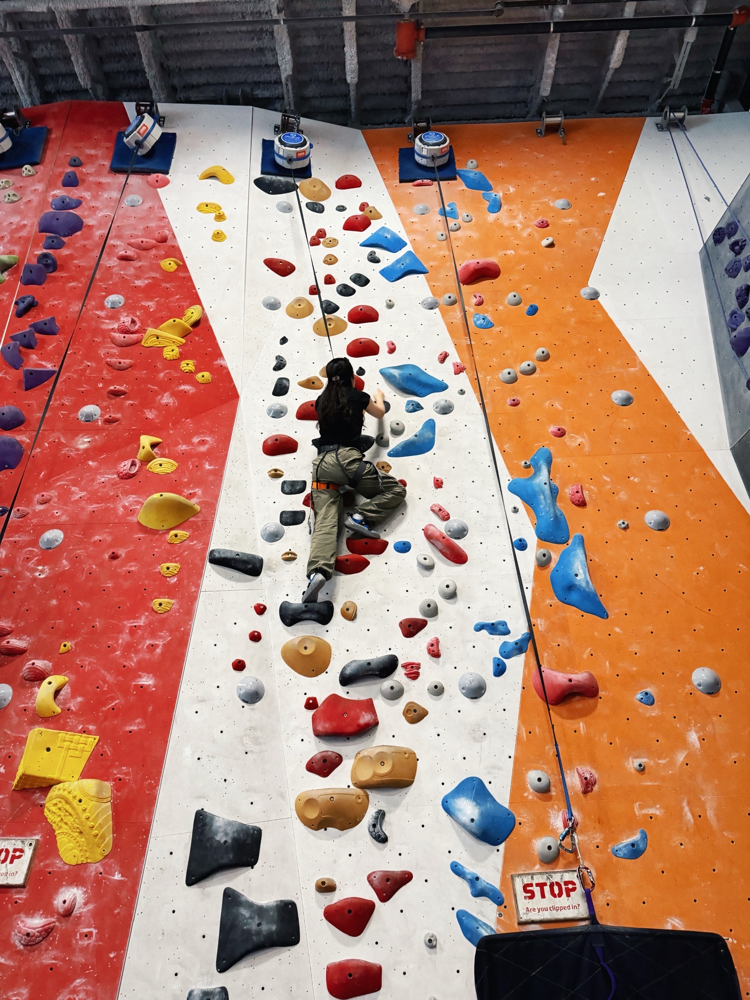
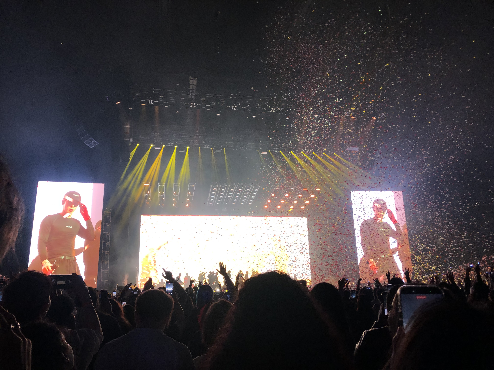

::: {.hero}
::: {.hero-text}

  <h1>Zihan Hei</h1>
  

## Statistics · Biostatistics · AI for Health

I am an undergraduate statistics student at Binghamton University working across bioinformatics, mental health evaluation, mixed-methods research, and data visualization. I am especially interested in **biostatistics, AI-related health research, cancer biomarker discovery, statistical learning, and reproducible data science**.

[Download CV](files/Zihan_Hei_CV.pdf){.btn .btn-primary} [Explore Research](research.qmd){.btn .btn-outline-primary}

:::

::: {.hero-card}

### Current focus

- Cancer biomarker discovery and RNA-seq validation
- Health information avoidance and political psychology
- Mental health workshop evaluation
- Interactive and reproducible research tools

:::

:::

## About me

My work combines statistical modeling, machine learning, survey design, mixed-methods analysis, and interactive data visualization to address questions in public health and healthcare. I enjoy building reproducible workflows and accessible research tools using R, Python, Quarto, R Shiny, Observable JS, Qualtrics, and GitHub.

## Research at a glance

::: {.stats-grid}
::: {.stat-card}

7+

Research projects

:::
::: {.stat-card}

5

Faculty mentors

:::
::: {.stat-card}

2

Technical publications

:::
::: {.stat-card}

3+

Conference outputs

:::
:::

## Selected work

::: {.grid}
::: {.g-col-12 .g-col-md-4 .project-card}
### Biomarker discovery

Differential expression, GSEA, and cross-study validation for chemo-immunotherapy response research.

[Learn more](research.qmd#chemo-immunotherapy-biomarker-discovery)
:::
::: {.g-col-12 .g-col-md-4 .project-card}
### FRI data infrastructure

Qualtrics, Google Apps Script, and R Shiny workflows supporting dissemination tracking and program evaluation.

[View work experience](work-experience.qmd#quantitative-intern-first-year-research-immersion-program)
:::
::: {.g-col-12 .g-col-md-4 .project-card}
### Peer mentor guide

Co-authored an open-access Quarto guide supporting reflection, self-awareness, and leadership development.

[View publication](publications.qmd#technical-publications)
:::
:::

## Skills: current strengths and learning goals

This interactive chart is a personal development snapshot rather than a formal proficiency measure. Hover over points to compare scores, and use the Plotly toolbar to zoom, reset, or save the chart.

## Research journey

::: {.timeline}
::: {.timeline-item}

2023–2024

<strong>FRI Community & Global Public Health</strong> Endometriosis, vaccine hesitancy, reproductive health, survey research, and poster presentations.

:::
::: {.timeline-item}

2025

<strong>Research expansion</strong> R peer mentoring, promotion and prevention mindsets, zero-sum beliefs, and health information avoidance.

:::
::: {.timeline-item}

2025–2026

<strong>Bioinformatics and AI</strong> Chemo-immunotherapy biomarker validation, deep learning, and reinforcement learning projects.

:::
::: {.timeline-item}

2026–Present

<strong>Paid quantitative internships</strong> FRI data infrastructure and mental health workshop evaluation.

:::
:::

## Tools and platforms

These tools are grouped by how I use them across data analysis, visualization, reproducible research, survey design, and health-focused projects. Hover over a logo to see its name and category, and use the Plotly toolbar to pan, zoom, reset, or export the network, and **double-click anywhere on the plot to return to the original view**.

## Beyond research

Outside of research and coursework, I enjoy climbing, exploring photography, and experiencing live music.

::: {.photo-grid}

::: {.photo-card}
{.hobby-photo}

::: {.photo-caption}
### Climbing

I enjoy climbing as a way to challenge myself, stay active, and step away from the screen.
:::
:::

::: {.photo-card}
{.hobby-photo}

::: {.photo-caption}
### Photography

Photography gives me a different way to observe and capture the places, people, and moments around me.
:::
:::

::: {.photo-card}
{.hobby-photo}

::: {.photo-caption}
### Live music

I enjoy going to concerts and discovering new music—one of my favorite ways to recharge outside of academics.
:::
:::

:::

